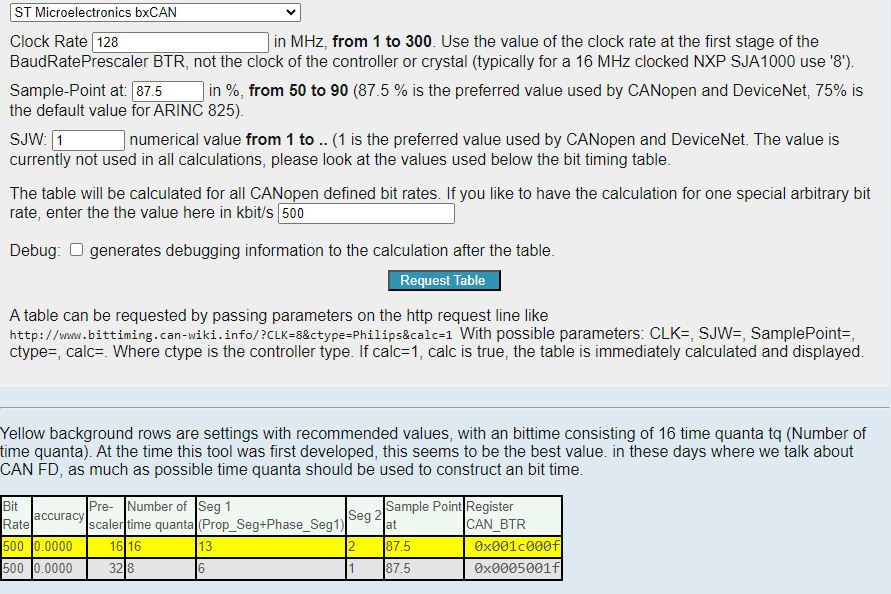
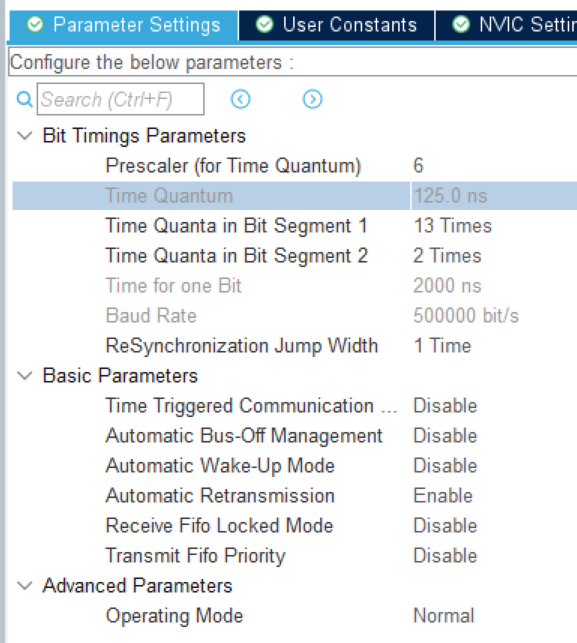
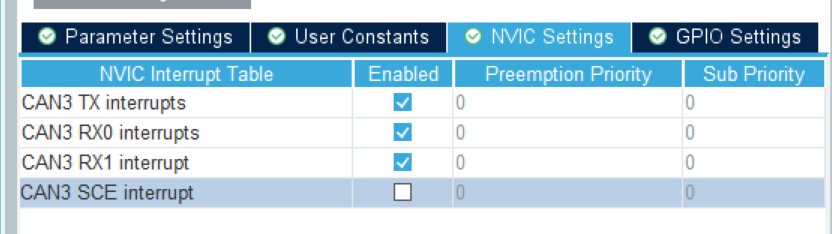
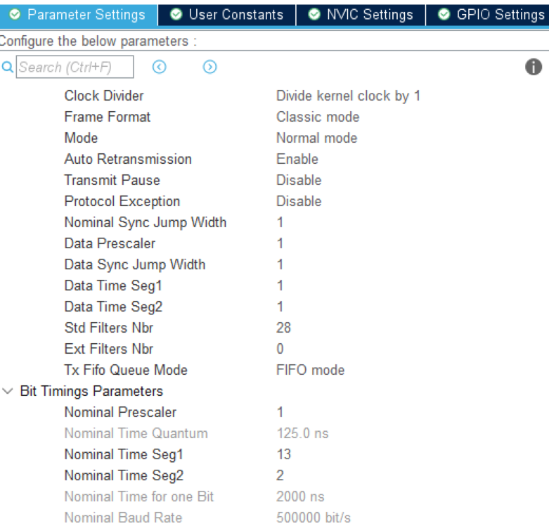
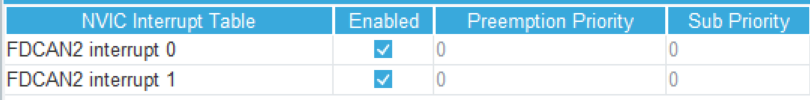
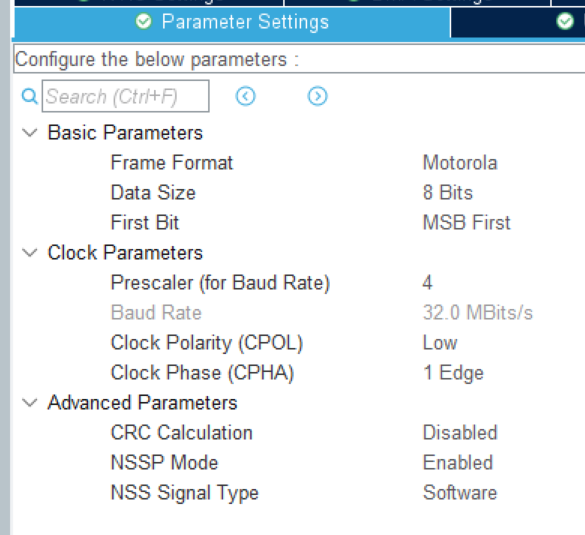

# CANOpen Library
CANOpen library for stm32 helps with easier configuration of the whole CAN bus. It configures input filters automaticaly. You can configure all transmit and receive messages in CANOpenArchitect or similar software. CANOpen library can use persistent storage to configure devices through can and save statistical data.

You can use this library in CAN legacy mode, when you don't have other CANOpen devices on the bus. It will do all the configuration, tramsit and receive handling for you.

## How to configure CAN interface in MXCube
Calculate bit timing on site [CAN Bit timing calculator](http://www.bittiming.can-wiki.info/)
Select proper Clock rate from clock configuration tab in MXCube. 500kbit/s bitrate is used in our car.
We are aiming to achieve 87.5% sample point. Usually the highlighted configuration is the best. If calculator can't achieve our desired sampling point, you have to change clock configuration of CAN interface in MXCube.



After that configure MX cube according to next images:

### BxCAN interface configuration in MXCube (STM32F103/F4 MCUs)




### FDCAN interface configuration in MXCube (STM32H7/G4 MCUs)




## How to add library to your project:
Add this library as a submodule:
```
cd Libraries
git submodule add https://gitlab.com/tubrno-e2/canopenlibrary.git
cd canopenlibrary
git submodule init
git submodule update
```

Generate Object dictionary files with EDSSharp

```
 .\EDSSharp.exe --type CanOpenNodeV4 --infile file.eds --outfile ODGen
```

Place ODGen.c and ODGen.h into ./Core

Add these directories into Cmakelist IncludeDirectories

```
Libraries/canopenlibrary Libraries/canopenlibrary/CANopenNode Core/
```

Add canopelibrary directory into Cmakelist file

```
file(GLOB_RECURSE SOURCES "Core/*.*" "Drivers/*.*" "Libraries/canopenlibrary/*.*")
```

Add definitions inside Cmakelist to select slave or master CANOpen operation. (Only valid masters are VCU and BMS Master for slave BMS)

```
add_definitions(-DCO_CONFIG_SLAVE)
# Or
add_definitions(-DCO_CONFIG_MASTER)
```

Include CANOpen_Main and object dictionary
```
#include "Canopen_Main.h"
#include "ODGen.h"
```
Create CanOpen global variable
```
CO_t * CanOpenGen;
```

In program setup, create CO config, and initialize CANOpen, dont forget to set proper nodeId
```
CO_config_t *configGen;
CO_CREATE_OD_CONFIG(ODGen, configGen);
CanOpenGen = CANOpenInit(&hcanX, configGen, ODGen, nodeID);
/* Uncomment for optional storage init */
// CANOpenStorageInit(CanOpenGen, ODGen, configGen, &flashConfig);
```
If your board has multiple CAN interfaces, init CANOpen for all of them
```
CO_config_t *configCrit;
CO_CREATE_OD_CONFIG(ODCrit, configCrit);
CanOpenCrit = CANOpenInit(&hfdcanX, configGen, ODCrit, nodeID);
```
Setup 1000hz loop or timer with 1ms period, and call this function from it:
```
CANOpenProcess(CanOpenGen, HAL_GetTick());
```
You need one process for every CanOpen instance.

How to access variable from object dictionary:
```
ODGen_RAM.x6000_pressures
```
## How to enable persistent storage
Only supported storage options currently are:
- W25qxx (Driver available in StmLibraries)
- TBD

Add STM Libraries as submodule and add W25QXX driver to Cmakelists

Enable CANOpen storage inside Cmakelist:
```
add_definitions(-DCO_CONFIG_STORAGE)
```
Prepare w25qxx flash config with correct ports:
```
w25qxx_conf_t flashConfig;
flashConfig.hspi = &hspiX;
flashConfig.gpio = FLASH_CHIP_SELECT_GPIO_Port;
flashConfig.pin = FLASH_CHIP_SELECT_Pin;
```
Init storage after CANOpenInit:
```
CANOpenStorageInit(CanOpenGen, ODGen, configGen, &flashConfig);
```
Currently you can have storage enabled only on one CANOpen instance.

### MXCube FLASH configuration
SPI Mode: Full duplex master



# Legacy CAN mode

CANOpen library supports interface in legacy CAN mode. You can send and receive custom CAN messages while still using excelent CANOpenLibrary buffer and error handling.

## Legacy mode setup

Initialize CANOpen library in Legacy mode:
```
CANOpenInitLegacyCanInterface(&hfdcanX, &CANRxCallback);
```

You have to define your own custom callback function, which will be called everytime CAN bus receives new message.
For example:
```
void CANRxCallback(CO_CANrxMsg_t rcvMsg)
{
    printf("Receive message\r\n");
}
```
Call periodic task in at least 100Hz loop.
```
void loop_100Hz(void) {
    CANOpenLegacyPeriodicTask(&hfdcanx);
}
```
Example of sending custom CAN message:
```
uint8_t buff[8] = {0, 1, 2, 3, 4, 5, 6, 7};
CANOpenSendLegacyCanMessage(&hfdcan2, ID, 8, buff);
```


# Changelog
- V2.0 - Persisten storage driver for W25qXX flash. Enhance legacy mode support. Add EMCY error states.
- V1.1 - Float to fixed point converter
- V1.0 - Add driver implementation for FDCAN and BxCAN peripheral


